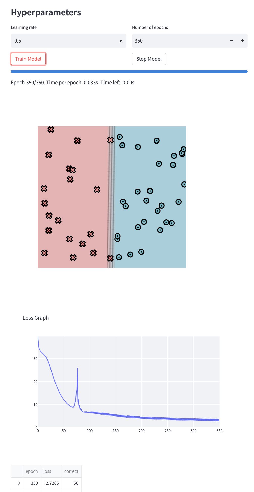
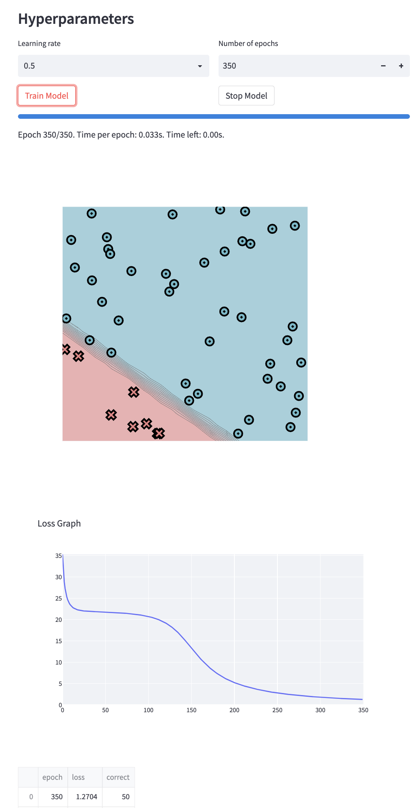
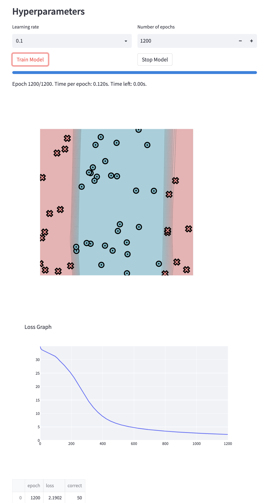
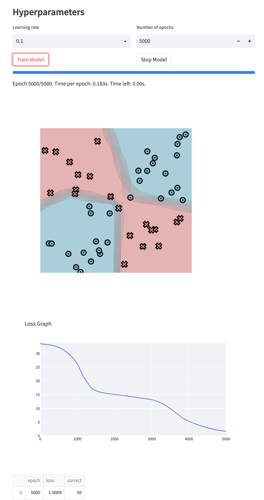

[](https://classroom.github.com/a/YFgwt0yY)
# MiniTorch Module 2


* Docs: https://minitorch.github.io/

* Overview: https://minitorch.github.io/module2/module2/

This assignment requires the following files from the previous assignments. You can get these by running

```bash
python sync_previous_module.py previous-module-dir current-module-dir
```

The files that will be synced are:

        minitorch/operators.py minitorch/module.py minitorch/autodiff.py minitorch/scalar.py minitorch/scalar_functions.py minitorch/module.py project/run_manual.py project/run_scalar.py project/datasets.py


## Task 2.5: Visualization
### Classification of Simple Model

**Parameters used:**
- `Hidden dimensions`: 2
- `Learning rate`: 0.5
- `Number of epochs`: 350

Here, time per epoch is 0.034s.
```bash
Epoch: 10/350, loss: 32.436082980043416, correct: 30
Epoch: 20/350, loss: 29.341387175168677, correct: 36
Epoch: 30/350, loss: 22.264267451242, correct: 43
Epoch: 40/350, loss: 16.497158843468245, correct: 45
Epoch: 50/350, loss: 12.430251261257293, correct: 48
Epoch: 60/350, loss: 9.84899356029771, correct: 48
Epoch: 70/350, loss: 8.833422804084865, correct: 50
Epoch: 80/350, loss: 9.278626825213227, correct: 47
Epoch: 90/350, loss: 6.587647910865218, correct: 50
Epoch: 100/350, loss: 6.386509005092816, correct: 50
Epoch: 110/350, loss: 6.144449818874229, correct: 50
Epoch: 120/350, loss: 5.791436465188061, correct: 50
Epoch: 130/350, loss: 5.456313433739345, correct: 50
Epoch: 140/350, loss: 5.142166911744111, correct: 50
Epoch: 150/350, loss: 4.868046838937319, correct: 50
Epoch: 160/350, loss: 4.625129800493799, correct: 50
Epoch: 170/350, loss: 4.409295763165221, correct: 50
Epoch: 180/350, loss: 4.21865806667603, correct: 50
Epoch: 190/350, loss: 4.050096611284626, correct: 50
Epoch: 200/350, loss: 3.7741341467088567, correct: 50
Epoch: 210/350, loss: 3.680315989870506, correct: 50
Epoch: 220/350, loss: 3.5887176396421436, correct: 50
Epoch: 230/350, loss: 3.509044169761541, correct: 50
Epoch: 240/350, loss: 3.4219689689117, correct: 50
Epoch: 250/350, loss: 3.3396584643566376, correct: 50
Epoch: 260/350, loss: 3.2625650959789363, correct: 50
Epoch: 270/350, loss: 3.1216234106788483, correct: 50
Epoch: 280/350, loss: 3.0685716908792178, correct: 50
Epoch: 290/350, loss: 3.016031857324415, correct: 50
Epoch: 300/350, loss: 2.964465099115063, correct: 50
Epoch: 310/350, loss: 2.914210311864267, correct: 50
Epoch: 320/350, loss: 2.865448845400501, correct: 50
Epoch: 330/350, loss: 2.8182488114046405, correct: 50
Epoch: 340/350, loss: 2.7726055984297524, correct: 50
Epoch: 350/350, loss: 2.7284696582400847, correct: 50
```

### Classification of Diagonal Model

**Parameters used:**
- `Hidden dimensions`: 2
- `Learning rate`: 0.5
- `Number of epochs`: 350

Here, time per epoch is 0.034s.
```bash
Epoch: 10/350, loss: 23.459759448703693, correct: 42
Epoch: 20/350, loss: 22.21231699262747, correct: 42
Epoch: 30/350, loss: 21.95308807864115, correct: 42
Epoch: 40/350, loss: 21.850622108924906, correct: 42
Epoch: 50/350, loss: 21.76872438592222, correct: 42
Epoch: 60/350, loss: 21.673660168222764, correct: 42
Epoch: 70/350, loss: 21.548625134401785, correct: 42
Epoch: 80/350, loss: 21.375186616560715, correct: 42
Epoch: 90/350, loss: 21.126146745937096, correct: 42
Epoch: 100/350, loss: 20.75596780584937, correct: 42
Epoch: 110/350, loss: 20.189626202934413, correct: 42
Epoch: 120/350, loss: 19.302792877991447, correct: 42
Epoch: 130/350, loss: 17.92975491017791, correct: 42
Epoch: 140/350, loss: 15.966428705290674, correct: 42
Epoch: 150/350, loss: 13.530952095774465, correct: 43
Epoch: 160/350, loss: 11.132054593567904, correct: 47
Epoch: 170/350, loss: 9.102569290679204, correct: 50
Epoch: 180/350, loss: 7.468204720854645, correct: 50
Epoch: 190/350, loss: 6.225755100542385, correct: 50
Epoch: 200/350, loss: 5.28343581873678, correct: 50
Epoch: 210/350, loss: 4.571977817534627, correct: 50
Epoch: 220/350, loss: 3.9972373460561594, correct: 50
Epoch: 230/350, loss: 3.522393043694163, correct: 50
Epoch: 240/350, loss: 3.129678301321075, correct: 50
Epoch: 250/350, loss: 2.8086780001909366, correct: 50
Epoch: 260/350, loss: 2.541039882562998, correct: 50
Epoch: 270/350, loss: 2.3122692397771156, correct: 50
Epoch: 280/350, loss: 2.1166384707015404, correct: 50
Epoch: 290/350, loss: 1.9461044522193545, correct: 50
Epoch: 300/350, loss: 1.7973372109384138, correct: 50
Epoch: 310/350, loss: 1.666843305708421, correct: 50
Epoch: 320/350, loss: 1.5510512315517526, correct: 50
Epoch: 330/350, loss: 1.447561868222571, correct: 50
Epoch: 340/350, loss: 1.3544367773640003, correct: 50
Epoch: 350/350, loss: 1.270357729951996, correct: 50
```

### Classification of Split Model

**Parameters used:**
- `Hidden dimensions`: 6
- `Learning rate`: 0.1
- `Number of epochs`: 1200

Here, time per epoch is 0.120s.
```bash
Epoch: 10/1200, loss: 33.75287358861511, correct: 30
Epoch: 20/1200, loss: 33.40464890531707, correct: 30
Epoch: 30/1200, loss: 33.11090916446097, correct: 30
Epoch: 40/1200, loss: 32.834102026295724, correct: 30
Epoch: 50/1200, loss: 32.56840835406104, correct: 30
Epoch: 60/1200, loss: 32.30316413410266, correct: 30
Epoch: 70/1200, loss: 32.06258468770563, correct: 30
Epoch: 80/1200, loss: 31.80270589715011, correct: 30
Epoch: 90/1200, loss: 31.494777870135746, correct: 30
Epoch: 100/1200, loss: 31.10123677836838, correct: 30
Epoch: 110/1200, loss: 30.609110957753405, correct: 30
Epoch: 120/1200, loss: 29.923229644497802, correct: 30
Epoch: 130/1200, loss: 29.357353184003394, correct: 32
Epoch: 140/1200, loss: 28.80791792591514, correct: 32
Epoch: 150/1200, loss: 28.218831502584855, correct: 36
Epoch: 160/1200, loss: 27.581294834832324, correct: 37
Epoch: 170/1200, loss: 26.91195120377721, correct: 37
Epoch: 180/1200, loss: 26.231956670399, correct: 38
Epoch: 190/1200, loss: 25.53147958323565, correct: 40
Epoch: 200/1200, loss: 24.790119689793006, correct: 40
Epoch: 210/1200, loss: 23.981142634487032, correct: 40
Epoch: 220/1200, loss: 23.127197559279473, correct: 40
Epoch: 230/1200, loss: 22.176893555981607, correct: 40
Epoch: 240/1200, loss: 21.258859255337388, correct: 42
Epoch: 250/1200, loss: 20.283916819935268, correct: 43
Epoch: 260/1200, loss: 19.29321079559171, correct: 44
Epoch: 270/1200, loss: 18.30486019535091, correct: 45
Epoch: 280/1200, loss: 17.332090000599795, correct: 49
Epoch: 290/1200, loss: 16.389476298188757, correct: 49
Epoch: 300/1200, loss: 15.483422390492096, correct: 49
Epoch: 310/1200, loss: 14.626546253749988, correct: 49
Epoch: 320/1200, loss: 13.812693531864507, correct: 49
Epoch: 330/1200, loss: 13.041498485555177, correct: 49
Epoch: 340/1200, loss: 12.323894457232988, correct: 49
Epoch: 350/1200, loss: 11.64854747461455, correct: 49
Epoch: 360/1200, loss: 11.020972591531471, correct: 49
Epoch: 370/1200, loss: 10.443549873629202, correct: 49
Epoch: 380/1200, loss: 9.91397787756046, correct: 49
Epoch: 390/1200, loss: 9.422580950370795, correct: 49
Epoch: 400/1200, loss: 8.952785798633517, correct: 49
Epoch: 410/1200, loss: 8.524833255198788, correct: 49
Epoch: 420/1200, loss: 8.13568939288315, correct: 49
Epoch: 430/1200, loss: 7.781527373932244, correct: 49
Epoch: 440/1200, loss: 7.4620640818990545, correct: 49
Epoch: 450/1200, loss: 7.173723832358837, correct: 49
Epoch: 460/1200, loss: 6.91284095698224, correct: 49
Epoch: 470/1200, loss: 6.673561317310151, correct: 49
Epoch: 480/1200, loss: 6.453467112604272, correct: 49
Epoch: 490/1200, loss: 6.25030465957716, correct: 49
Epoch: 500/1200, loss: 6.062073630283541, correct: 49
Epoch: 510/1200, loss: 5.887454899686567, correct: 49
Epoch: 520/1200, loss: 5.724995748330496, correct: 49
Epoch: 530/1200, loss: 5.57395469603209, correct: 49
Epoch: 540/1200, loss: 5.4322300661216385, correct: 49
Epoch: 550/1200, loss: 5.299253232495466, correct: 49
Epoch: 560/1200, loss: 5.17390817721097, correct: 49
Epoch: 570/1200, loss: 5.05558110263065, correct: 49
Epoch: 580/1200, loss: 4.944125895708023, correct: 49
Epoch: 590/1200, loss: 4.838369296618525, correct: 49
Epoch: 600/1200, loss: 4.738088485895797, correct: 49
Epoch: 610/1200, loss: 4.642975952960937, correct: 49
Epoch: 620/1200, loss: 4.551901525723143, correct: 49
Epoch: 630/1200, loss: 4.465477067823725, correct: 49
Epoch: 640/1200, loss: 4.382976593829429, correct: 49
Epoch: 650/1200, loss: 4.304046459710235, correct: 49
Epoch: 660/1200, loss: 4.228051953918767, correct: 49
Epoch: 670/1200, loss: 4.15537617249795, correct: 49
Epoch: 680/1200, loss: 4.085666239307512, correct: 49
Epoch: 690/1200, loss: 4.018654425965818, correct: 49
Epoch: 700/1200, loss: 3.9541349843087965, correct: 49
Epoch: 710/1200, loss: 3.8922314579251616, correct: 49
Epoch: 720/1200, loss: 3.8329694477373404, correct: 49
Epoch: 730/1200, loss: 3.7756742465370556, correct: 49
Epoch: 740/1200, loss: 3.7198311813943796, correct: 49
Epoch: 750/1200, loss: 3.665801269643172, correct: 49
Epoch: 760/1200, loss: 3.613365095395561, correct: 49
Epoch: 770/1200, loss: 3.5626490768345374, correct: 49
Epoch: 780/1200, loss: 3.513573477241375, correct: 49
Epoch: 790/1200, loss: 3.4657490194095626, correct: 49
Epoch: 800/1200, loss: 3.419411871847637, correct: 49
Epoch: 810/1200, loss: 3.37434009107204, correct: 49
Epoch: 820/1200, loss: 3.3304948604270925, correct: 49
Epoch: 830/1200, loss: 3.287640380173495, correct: 49
Epoch: 840/1200, loss: 3.24554592989388, correct: 49
Epoch: 850/1200, loss: 3.204395861953359, correct: 49
Epoch: 860/1200, loss: 3.16431414356929, correct: 49
Epoch: 870/1200, loss: 3.125659480345293, correct: 49
Epoch: 880/1200, loss: 3.087655657425661, correct: 49
Epoch: 890/1200, loss: 3.050053116144029, correct: 49
Epoch: 900/1200, loss: 3.013648731797349, correct: 49
Epoch: 910/1200, loss: 2.9782888130701513, correct: 49
Epoch: 920/1200, loss: 2.942953136764063, correct: 49
Epoch: 930/1200, loss: 2.909348501833829, correct: 49
Epoch: 940/1200, loss: 2.8755399969565483, correct: 49
Epoch: 950/1200, loss: 2.842774751314339, correct: 49
Epoch: 960/1200, loss: 2.810672493898847, correct: 49
Epoch: 970/1200, loss: 2.77915638322929, correct: 49
Epoch: 980/1200, loss: 2.7481221889682326, correct: 49
Epoch: 990/1200, loss: 2.718192435430706, correct: 49
Epoch: 1000/1200, loss: 2.687891895679348, correct: 49
Epoch: 1010/1200, loss: 2.659255675758051, correct: 50
Epoch: 1020/1200, loss: 2.6301945472084793, correct: 50
Epoch: 1030/1200, loss: 2.6017502262955325, correct: 50
Epoch: 1040/1200, loss: 2.574688985023012, correct: 50
Epoch: 1050/1200, loss: 2.5473612059580892, correct: 50
Epoch: 1060/1200, loss: 2.51988402058124, correct: 50
Epoch: 1070/1200, loss: 2.493899261609729, correct: 50
Epoch: 1080/1200, loss: 2.4682839196272033, correct: 50
Epoch: 1090/1200, loss: 2.4433234779943884, correct: 50
Epoch: 1100/1200, loss: 2.418224894914391, correct: 50
Epoch: 1110/1200, loss: 2.393308954283613, correct: 50
Epoch: 1120/1200, loss: 2.3689687318731956, correct: 50
Epoch: 1130/1200, loss: 2.3452194392510175, correct: 50
Epoch: 1140/1200, loss: 2.321666058720106, correct: 50
Epoch: 1150/1200, loss: 2.298730950702492, correct: 50
Epoch: 1160/1200, loss: 2.276262767427857, correct: 50
Epoch: 1170/1200, loss: 2.254220929649463, correct: 50
Epoch: 1180/1200, loss: 2.232384382855226, correct: 50
Epoch: 1190/1200, loss: 2.211213006085269, correct: 50
Epoch: 1200/1200, loss: 2.190192108074114, correct: 50
```

### Classification of Xor Model

**Parameters used:**
- `Hidden dimensions`: 8
- `Learning rate`: 0.1
- `Number of epochs`: 5000

Here, time per epoch is 0.183s.

```bash
Epoch: 10/5000, loss: 33.552487210263365, correct: 30
Epoch: 20/5000, loss: 33.50641682328951, correct: 30
Epoch: 30/5000, loss: 33.48466152452576, correct: 30
Epoch: 40/5000, loss: 33.466697823298084, correct: 30
Epoch: 50/5000, loss: 33.449533844097814, correct: 30
Epoch: 60/5000, loss: 33.43461498676426, correct: 30
Epoch: 70/5000, loss: 33.42098860655744, correct: 30
Epoch: 80/5000, loss: 33.4074309638628, correct: 30
Epoch: 90/5000, loss: 33.39429082982846, correct: 30
Epoch: 100/5000, loss: 33.38124832282309, correct: 30
Epoch: 110/5000, loss: 33.368346397600384, correct: 30
Epoch: 120/5000, loss: 33.355241016189474, correct: 30
Epoch: 130/5000, loss: 33.34162113338451, correct: 30
Epoch: 140/5000, loss: 33.327510457348275, correct: 30
Epoch: 150/5000, loss: 33.312907701446, correct: 30
Epoch: 160/5000, loss: 33.29777702084045, correct: 30
Epoch: 170/5000, loss: 33.28208096979859, correct: 30
Epoch: 180/5000, loss: 33.26583714312194, correct: 30
Epoch: 190/5000, loss: 33.24883227896823, correct: 30
Epoch: 200/5000, loss: 33.231440689663636, correct: 30
Epoch: 210/5000, loss: 33.213207375665505, correct: 30
Epoch: 220/5000, loss: 33.19404753572358, correct: 30
Epoch: 230/5000, loss: 33.174494003494026, correct: 30
Epoch: 240/5000, loss: 33.15518569590661, correct: 30
Epoch: 250/5000, loss: 33.13255517594837, correct: 30
Epoch: 260/5000, loss: 33.110123496745985, correct: 30
Epoch: 270/5000, loss: 33.08854094691951, correct: 30
Epoch: 280/5000, loss: 33.06443258262086, correct: 30
Epoch: 290/5000, loss: 33.03830554909947, correct: 30
Epoch: 300/5000, loss: 33.01187069974861, correct: 30
Epoch: 310/5000, loss: 32.98499784494856, correct: 30
Epoch: 320/5000, loss: 32.95790883036097, correct: 30
Epoch: 330/5000, loss: 32.926702627623754, correct: 30
Epoch: 340/5000, loss: 32.89795216347681, correct: 30
Epoch: 350/5000, loss: 32.86576196173286, correct: 30
Epoch: 360/5000, loss: 32.83066747119391, correct: 30
Epoch: 370/5000, loss: 32.796559016917776, correct: 30
Epoch: 380/5000, loss: 32.76154211085655, correct: 30
Epoch: 390/5000, loss: 32.722579190720786, correct: 30
Epoch: 400/5000, loss: 32.68412569898871, correct: 30
Epoch: 410/5000, loss: 32.64470146531262, correct: 30
Epoch: 420/5000, loss: 32.60141427565713, correct: 30
Epoch: 430/5000, loss: 32.55828566551085, correct: 30
Epoch: 440/5000, loss: 32.511836438136775, correct: 30
Epoch: 450/5000, loss: 32.464705829469715, correct: 30
Epoch: 460/5000, loss: 32.41575915389456, correct: 30
Epoch: 470/5000, loss: 32.36556517789271, correct: 30
Epoch: 480/5000, loss: 32.3132968731117, correct: 30
Epoch: 490/5000, loss: 32.259042012269084, correct: 30
Epoch: 500/5000, loss: 32.20310189414061, correct: 30
Epoch: 510/5000, loss: 32.14499528668171, correct: 30
Epoch: 520/5000, loss: 32.08441282627568, correct: 30
Epoch: 530/5000, loss: 32.02111979045644, correct: 30
Epoch: 540/5000, loss: 31.954926763355715, correct: 30
Epoch: 550/5000, loss: 31.885673120871463, correct: 30
Epoch: 560/5000, loss: 31.81321707413247, correct: 30
Epoch: 570/5000, loss: 31.737430006075815, correct: 30
Epoch: 580/5000, loss: 31.66048374088563, correct: 30
Epoch: 590/5000, loss: 31.580312361573377, correct: 30
Epoch: 600/5000, loss: 31.499307191224794, correct: 30
Epoch: 610/5000, loss: 31.41527159513431, correct: 30
Epoch: 620/5000, loss: 31.331529478595282, correct: 30
Epoch: 630/5000, loss: 31.244082604103188, correct: 30
Epoch: 640/5000, loss: 31.154260654361963, correct: 30
Epoch: 650/5000, loss: 31.06325050651625, correct: 30
Epoch: 660/5000, loss: 30.970000222687474, correct: 30
Epoch: 670/5000, loss: 30.876690793235298, correct: 30
Epoch: 680/5000, loss: 30.780973175311043, correct: 30
Epoch: 690/5000, loss: 30.68396842820774, correct: 30
Epoch: 700/5000, loss: 30.585435759054942, correct: 30
Epoch: 710/5000, loss: 30.485239470914397, correct: 30
Epoch: 720/5000, loss: 30.38269067860043, correct: 30
Epoch: 730/5000, loss: 30.27545162152919, correct: 30
Epoch: 740/5000, loss: 30.16733438129596, correct: 30
Epoch: 750/5000, loss: 30.056767925735834, correct: 30
Epoch: 760/5000, loss: 29.94293601736685, correct: 30
Epoch: 770/5000, loss: 29.825686811937345, correct: 30
Epoch: 780/5000, loss: 29.70489708013068, correct: 30
Epoch: 790/5000, loss: 29.580475164405208, correct: 30
Epoch: 800/5000, loss: 29.452381908309885, correct: 30
Epoch: 810/5000, loss: 29.32058075249752, correct: 30
Epoch: 820/5000, loss: 29.185033889301938, correct: 30
Epoch: 830/5000, loss: 29.04902892270514, correct: 30
Epoch: 840/5000, loss: 28.90891290345159, correct: 30
Epoch: 850/5000, loss: 28.76732473442812, correct: 30
Epoch: 860/5000, loss: 28.625164354190044, correct: 30
Epoch: 870/5000, loss: 28.476253504294828, correct: 30
Epoch: 880/5000, loss: 28.325795189434693, correct: 30
Epoch: 890/5000, loss: 28.168078567950158, correct: 30
Epoch: 900/5000, loss: 28.00937407279503, correct: 32
Epoch: 910/5000, loss: 27.84582905644322, correct: 32
Epoch: 920/5000, loss: 27.685792554233373, correct: 32
Epoch: 930/5000, loss: 27.500354216184203, correct: 33
Epoch: 940/5000, loss: 27.318733401354528, correct: 34
Epoch: 950/5000, loss: 27.132416919507705, correct: 35
Epoch: 960/5000, loss: 26.949773992157017, correct: 34
Epoch: 970/5000, loss: 26.739704829915848, correct: 37
Epoch: 980/5000, loss: 26.544724797921816, correct: 36
Epoch: 990/5000, loss: 26.33148731443036, correct: 38
Epoch: 1000/5000, loss: 26.10625159997634, correct: 38
Epoch: 1010/5000, loss: 25.874687339445803, correct: 39
Epoch: 1020/5000, loss: 25.626722890390287, correct: 39
Epoch: 1030/5000, loss: 25.384075771894985, correct: 39
Epoch: 1040/5000, loss: 25.131477956103023, correct: 40
Epoch: 1050/5000, loss: 24.849594583830843, correct: 40
Epoch: 1060/5000, loss: 24.555002451227512, correct: 40
Epoch: 1070/5000, loss: 24.272071788849995, correct: 42
Epoch: 1080/5000, loss: 24.01690265651022, correct: 41
Epoch: 1090/5000, loss: 23.725223575442428, correct: 41
Epoch: 1100/5000, loss: 23.41731117777123, correct: 42
Epoch: 1110/5000, loss: 23.1271905864617, correct: 42
Epoch: 1120/5000, loss: 22.8337470953883, correct: 42
Epoch: 1130/5000, loss: 22.49174475010984, correct: 41
Epoch: 1140/5000, loss: 22.154525765655524, correct: 41
Epoch: 1150/5000, loss: 21.83715504113988, correct: 41
Epoch: 1160/5000, loss: 21.609096126855494, correct: 41
Epoch: 1170/5000, loss: 21.41060231735807, correct: 41
Epoch: 1180/5000, loss: 21.18451847693671, correct: 41
Epoch: 1190/5000, loss: 20.968426122067612, correct: 41
Epoch: 1200/5000, loss: 20.770481315443853, correct: 41
Epoch: 1210/5000, loss: 20.59026570534817, correct: 41
Epoch: 1220/5000, loss: 20.385605635993535, correct: 41
Epoch: 1230/5000, loss: 20.183352246037, correct: 41
Epoch: 1240/5000, loss: 19.967919971917308, correct: 41
Epoch: 1250/5000, loss: 19.738419532902157, correct: 41
Epoch: 1260/5000, loss: 19.530482796864664, correct: 41
Epoch: 1270/5000, loss: 19.333694443875366, correct: 41
Epoch: 1280/5000, loss: 19.14916216355798, correct: 41
Epoch: 1290/5000, loss: 18.985185660088042, correct: 41
Epoch: 1300/5000, loss: 18.846810419662685, correct: 41
Epoch: 1310/5000, loss: 18.535233572114826, correct: 41
Epoch: 1320/5000, loss: 18.312862399693955, correct: 41
Epoch: 1330/5000, loss: 18.125303776197192, correct: 41
Epoch: 1340/5000, loss: 17.949876813341, correct: 41
Epoch: 1350/5000, loss: 17.789589617812467, correct: 41
Epoch: 1360/5000, loss: 17.643316337967075, correct: 41
Epoch: 1370/5000, loss: 17.50555286526267, correct: 41
Epoch: 1380/5000, loss: 17.37572172936864, correct: 41
Epoch: 1390/5000, loss: 17.25287272932585, correct: 41
Epoch: 1400/5000, loss: 17.136642577619302, correct: 41
Epoch: 1410/5000, loss: 17.036228268313135, correct: 41
Epoch: 1420/5000, loss: 16.94871921932403, correct: 41
Epoch: 1430/5000, loss: 16.86780711345047, correct: 41
Epoch: 1440/5000, loss: 16.791093913839614, correct: 41
Epoch: 1450/5000, loss: 16.717756511746902, correct: 41
Epoch: 1460/5000, loss: 16.6474201695144, correct: 41
Epoch: 1470/5000, loss: 16.579894043627363, correct: 41
Epoch: 1480/5000, loss: 16.51501117987218, correct: 41
Epoch: 1490/5000, loss: 16.453255456308312, correct: 41
Epoch: 1500/5000, loss: 16.393518107892756, correct: 41
Epoch: 1510/5000, loss: 16.336933449452317, correct: 41
Epoch: 1520/5000, loss: 16.28178722967611, correct: 41
Epoch: 1530/5000, loss: 16.230011172163632, correct: 41
Epoch: 1540/5000, loss: 16.18151669471243, correct: 41
Epoch: 1550/5000, loss: 16.13419200483836, correct: 41
Epoch: 1560/5000, loss: 16.089537904760853, correct: 41
Epoch: 1570/5000, loss: 16.046660469743216, correct: 41
Epoch: 1580/5000, loss: 16.007002926123235, correct: 41
Epoch: 1590/5000, loss: 15.967183667537139, correct: 41
Epoch: 1600/5000, loss: 15.930166328827056, correct: 41
Epoch: 1610/5000, loss: 15.893661035045554, correct: 41
Epoch: 1620/5000, loss: 15.85931800629865, correct: 41
Epoch: 1630/5000, loss: 15.826925952624, correct: 41
Epoch: 1640/5000, loss: 15.795622977749893, correct: 41
Epoch: 1650/5000, loss: 15.764793323689325, correct: 41
Epoch: 1660/5000, loss: 15.73457377651466, correct: 41
Epoch: 1670/5000, loss: 15.705722084284538, correct: 41
Epoch: 1680/5000, loss: 15.678532189633072, correct: 41
Epoch: 1690/5000, loss: 15.651704820403785, correct: 41
Epoch: 1700/5000, loss: 15.625651497263378, correct: 41
Epoch: 1710/5000, loss: 15.600104449914944, correct: 41
Epoch: 1720/5000, loss: 15.575167053899026, correct: 41
Epoch: 1730/5000, loss: 15.551118208001036, correct: 41
Epoch: 1740/5000, loss: 15.52656050290531, correct: 42
Epoch: 1750/5000, loss: 15.502759550765001, correct: 42
Epoch: 1760/5000, loss: 15.48137324439294, correct: 42
Epoch: 1770/5000, loss: 15.461049662509588, correct: 42
Epoch: 1780/5000, loss: 15.440547475350568, correct: 42
Epoch: 1790/5000, loss: 15.421306154142721, correct: 42
Epoch: 1800/5000, loss: 15.402181155746401, correct: 42
Epoch: 1810/5000, loss: 15.383669322618779, correct: 42
Epoch: 1820/5000, loss: 15.364783675673449, correct: 42
Epoch: 1830/5000, loss: 15.346038343689877, correct: 42
Epoch: 1840/5000, loss: 15.327665617123806, correct: 42
Epoch: 1850/5000, loss: 15.30970459487593, correct: 42
Epoch: 1860/5000, loss: 15.291027816411695, correct: 42
Epoch: 1870/5000, loss: 15.272632843429221, correct: 42
Epoch: 1880/5000, loss: 15.254260666897864, correct: 42
Epoch: 1890/5000, loss: 15.23621543210541, correct: 42
Epoch: 1900/5000, loss: 15.218039447523015, correct: 42
Epoch: 1910/5000, loss: 15.200214469302376, correct: 42
Epoch: 1920/5000, loss: 15.181742781716519, correct: 42
Epoch: 1930/5000, loss: 15.164879026543424, correct: 42
Epoch: 1940/5000, loss: 15.146944107787942, correct: 42
Epoch: 1950/5000, loss: 15.130116064380331, correct: 42
Epoch: 1960/5000, loss: 15.11395183207931, correct: 42
Epoch: 1970/5000, loss: 15.09671561287931, correct: 42
Epoch: 1980/5000, loss: 15.080310126223717, correct: 42
Epoch: 1990/5000, loss: 15.064812015770856, correct: 42
Epoch: 2000/5000, loss: 15.048336733399555, correct: 42
Epoch: 2010/5000, loss: 15.031920864259789, correct: 42
Epoch: 2020/5000, loss: 15.015723655851279, correct: 42
Epoch: 2030/5000, loss: 14.999441392988171, correct: 42
Epoch: 2040/5000, loss: 14.982255713882425, correct: 42
Epoch: 2050/5000, loss: 14.96626704514673, correct: 42
Epoch: 2060/5000, loss: 14.9497858438611, correct: 42
Epoch: 2070/5000, loss: 14.93389637783989, correct: 42
Epoch: 2080/5000, loss: 14.91673359687407, correct: 42
Epoch: 2090/5000, loss: 14.900334015475567, correct: 42
Epoch: 2100/5000, loss: 14.884102157742293, correct: 42
Epoch: 2110/5000, loss: 14.867990984102008, correct: 42
Epoch: 2120/5000, loss: 14.85221551115712, correct: 42
Epoch: 2130/5000, loss: 14.835163988632061, correct: 42
Epoch: 2140/5000, loss: 14.819367311768179, correct: 43
Epoch: 2150/5000, loss: 14.802414966762313, correct: 43
Epoch: 2160/5000, loss: 14.78570946969491, correct: 43
Epoch: 2170/5000, loss: 14.769145856237573, correct: 43
Epoch: 2180/5000, loss: 14.752704065583433, correct: 43
Epoch: 2190/5000, loss: 14.736369346289996, correct: 43
Epoch: 2200/5000, loss: 14.720273174768842, correct: 43
Epoch: 2210/5000, loss: 14.70260806374551, correct: 43
Epoch: 2220/5000, loss: 14.686569505918756, correct: 43
Epoch: 2230/5000, loss: 14.669230026200355, correct: 43
Epoch: 2240/5000, loss: 14.652023408497712, correct: 43
Epoch: 2250/5000, loss: 14.63514866693469, correct: 43
Epoch: 2260/5000, loss: 14.618111193593768, correct: 43
Epoch: 2270/5000, loss: 14.600926926322725, correct: 43
Epoch: 2280/5000, loss: 14.583946661813975, correct: 43
Epoch: 2290/5000, loss: 14.566591024761914, correct: 43
Epoch: 2300/5000, loss: 14.549472843393167, correct: 43
Epoch: 2310/5000, loss: 14.53152647341513, correct: 43
Epoch: 2320/5000, loss: 14.514767019269962, correct: 43
Epoch: 2330/5000, loss: 14.497466071006818, correct: 43
Epoch: 2340/5000, loss: 14.480382379427386, correct: 43
Epoch: 2350/5000, loss: 14.46348235518805, correct: 43
Epoch: 2360/5000, loss: 14.44615174923446, correct: 43
Epoch: 2370/5000, loss: 14.429239821675516, correct: 43
Epoch: 2380/5000, loss: 14.412197407617223, correct: 43
Epoch: 2390/5000, loss: 14.39538386283985, correct: 43
Epoch: 2400/5000, loss: 14.378558579941517, correct: 43
Epoch: 2410/5000, loss: 14.361674163296065, correct: 43
Epoch: 2420/5000, loss: 14.34472467631875, correct: 43
Epoch: 2430/5000, loss: 14.327694491918148, correct: 43
Epoch: 2440/5000, loss: 14.31079953876133, correct: 43
Epoch: 2450/5000, loss: 14.293382044482994, correct: 43
Epoch: 2460/5000, loss: 14.27621650479869, correct: 43
Epoch: 2470/5000, loss: 14.258967360523256, correct: 43
Epoch: 2480/5000, loss: 14.241565616505394, correct: 43
Epoch: 2490/5000, loss: 14.224005491616957, correct: 43
Epoch: 2500/5000, loss: 14.206552553605828, correct: 43
Epoch: 2510/5000, loss: 14.18857234765813, correct: 43
Epoch: 2520/5000, loss: 14.171044474480437, correct: 43
Epoch: 2530/5000, loss: 14.153224317917044, correct: 43
Epoch: 2540/5000, loss: 14.135313260518416, correct: 43
Epoch: 2550/5000, loss: 14.116911662734102, correct: 43
Epoch: 2560/5000, loss: 14.098635466542794, correct: 43
Epoch: 2570/5000, loss: 14.080484259446642, correct: 43
Epoch: 2580/5000, loss: 14.062185683433462, correct: 43
Epoch: 2590/5000, loss: 14.043528036350933, correct: 43
Epoch: 2600/5000, loss: 14.024973769360335, correct: 43
Epoch: 2610/5000, loss: 14.006296118518936, correct: 43
Epoch: 2620/5000, loss: 13.987749624043934, correct: 43
Epoch: 2630/5000, loss: 13.968830800431792, correct: 43
Epoch: 2640/5000, loss: 13.949722395488262, correct: 43
Epoch: 2650/5000, loss: 13.930528254945846, correct: 43
Epoch: 2660/5000, loss: 13.911116708318918, correct: 43
Epoch: 2670/5000, loss: 13.891513575804492, correct: 43
Epoch: 2680/5000, loss: 13.871708977062516, correct: 43
Epoch: 2690/5000, loss: 13.851901003738622, correct: 43
Epoch: 2700/5000, loss: 13.831964793904207, correct: 43
Epoch: 2710/5000, loss: 13.811727799150654, correct: 43
Epoch: 2720/5000, loss: 13.791624335215916, correct: 43
Epoch: 2730/5000, loss: 13.771364610218631, correct: 43
Epoch: 2740/5000, loss: 13.750868689932885, correct: 43
Epoch: 2750/5000, loss: 13.730254344828854, correct: 43
Epoch: 2760/5000, loss: 13.709333323600125, correct: 43
Epoch: 2770/5000, loss: 13.688385036709645, correct: 43
Epoch: 2780/5000, loss: 13.666583809910007, correct: 43
Epoch: 2790/5000, loss: 13.6459085100375, correct: 43
Epoch: 2800/5000, loss: 13.623519626627596, correct: 43
Epoch: 2810/5000, loss: 13.60148137824924, correct: 43
Epoch: 2820/5000, loss: 13.578810654888636, correct: 43
Epoch: 2830/5000, loss: 13.556053569235972, correct: 43
Epoch: 2840/5000, loss: 13.532980717793958, correct: 43
Epoch: 2850/5000, loss: 13.509664505724691, correct: 43
Epoch: 2860/5000, loss: 13.485962514165799, correct: 43
Epoch: 2870/5000, loss: 13.461837273783102, correct: 43
Epoch: 2880/5000, loss: 13.437733182768373, correct: 43
Epoch: 2890/5000, loss: 13.413527239535933, correct: 43
Epoch: 2900/5000, loss: 13.389662313089017, correct: 43
Epoch: 2910/5000, loss: 13.366081534930663, correct: 43
Epoch: 2920/5000, loss: 13.342310153225677, correct: 43
Epoch: 2930/5000, loss: 13.31799000822152, correct: 43
Epoch: 2940/5000, loss: 13.293471869333013, correct: 43
Epoch: 2950/5000, loss: 13.268903728316932, correct: 43
Epoch: 2960/5000, loss: 13.244160065894256, correct: 43
Epoch: 2970/5000, loss: 13.219133220996651, correct: 43
Epoch: 2980/5000, loss: 13.193859571947554, correct: 43
Epoch: 2990/5000, loss: 13.168264690061653, correct: 43
Epoch: 3000/5000, loss: 13.142163230536768, correct: 43
Epoch: 3010/5000, loss: 13.115456015674178, correct: 43
Epoch: 3020/5000, loss: 13.088089471412934, correct: 43
Epoch: 3030/5000, loss: 13.060025172499557, correct: 43
Epoch: 3040/5000, loss: 13.029024773046501, correct: 43
Epoch: 3050/5000, loss: 12.994559263030773, correct: 43
Epoch: 3060/5000, loss: 12.952593590184884, correct: 43
Epoch: 3070/5000, loss: 12.910356793255394, correct: 43
Epoch: 3080/5000, loss: 12.86825747910413, correct: 43
Epoch: 3090/5000, loss: 12.82591632294321, correct: 43
Epoch: 3100/5000, loss: 12.78403392372148, correct: 43
Epoch: 3110/5000, loss: 12.740285324442954, correct: 43
Epoch: 3120/5000, loss: 12.695276843953332, correct: 43
Epoch: 3130/5000, loss: 12.649015979011198, correct: 43
Epoch: 3140/5000, loss: 12.605823146651696, correct: 43
Epoch: 3150/5000, loss: 12.562118415628902, correct: 43
Epoch: 3160/5000, loss: 12.495776575003461, correct: 43
Epoch: 3170/5000, loss: 12.435182056931511, correct: 43
Epoch: 3180/5000, loss: 12.375328615113087, correct: 43
Epoch: 3190/5000, loss: 12.313383924681204, correct: 43
Epoch: 3200/5000, loss: 12.253218365701875, correct: 43
Epoch: 3210/5000, loss: 12.197181414488684, correct: 44
Epoch: 3220/5000, loss: 12.133582992832052, correct: 44
Epoch: 3230/5000, loss: 12.07328933366008, correct: 44
Epoch: 3240/5000, loss: 12.014604682318565, correct: 44
Epoch: 3250/5000, loss: 11.958736314082405, correct: 44
Epoch: 3260/5000, loss: 11.90159409165849, correct: 44
Epoch: 3270/5000, loss: 11.833823569479492, correct: 44
Epoch: 3280/5000, loss: 11.778949628228979, correct: 44
Epoch: 3290/5000, loss: 11.722751719558188, correct: 44
Epoch: 3300/5000, loss: 11.616021104660259, correct: 44
Epoch: 3310/5000, loss: 11.519910531471924, correct: 45
Epoch: 3320/5000, loss: 11.417269086343865, correct: 45
Epoch: 3330/5000, loss: 11.351928737152653, correct: 45
Epoch: 3340/5000, loss: 11.269251114358541, correct: 45
Epoch: 3350/5000, loss: 11.202581450204653, correct: 45
Epoch: 3360/5000, loss: 11.131855665495078, correct: 45
Epoch: 3370/5000, loss: 11.045756256345872, correct: 45
Epoch: 3380/5000, loss: 10.964313284907755, correct: 45
Epoch: 3390/5000, loss: 10.892877766199016, correct: 45
Epoch: 3400/5000, loss: 10.817275891509516, correct: 45
Epoch: 3410/5000, loss: 10.722149833688047, correct: 45
Epoch: 3420/5000, loss: 10.655319912793896, correct: 46
Epoch: 3430/5000, loss: 10.56284024735678, correct: 46
Epoch: 3440/5000, loss: 10.469291819086052, correct: 46
Epoch: 3450/5000, loss: 10.385160792056574, correct: 46
Epoch: 3460/5000, loss: 10.297692493054173, correct: 46
Epoch: 3470/5000, loss: 10.206955208987964, correct: 46
Epoch: 3480/5000, loss: 10.114623154898647, correct: 46
Epoch: 3490/5000, loss: 10.023359895151271, correct: 46
Epoch: 3500/5000, loss: 9.917379175396011, correct: 46
Epoch: 3510/5000, loss: 9.811272846323028, correct: 47
Epoch: 3520/5000, loss: 9.701946366931413, correct: 47
Epoch: 3530/5000, loss: 9.589581804135983, correct: 47
Epoch: 3540/5000, loss: 9.484272284960317, correct: 47
Epoch: 3550/5000, loss: 9.383509297432244, correct: 47
Epoch: 3560/5000, loss: 9.280054144540248, correct: 48
Epoch: 3570/5000, loss: 9.173445578816247, correct: 48
Epoch: 3580/5000, loss: 9.059777306024912, correct: 48
Epoch: 3590/5000, loss: 8.95568970484286, correct: 48
Epoch: 3600/5000, loss: 8.856363024078131, correct: 48
Epoch: 3610/5000, loss: 8.749084824809694, correct: 48
Epoch: 3620/5000, loss: 8.635646402105026, correct: 48
Epoch: 3630/5000, loss: 8.535456572741728, correct: 48
Epoch: 3640/5000, loss: 8.434864471560951, correct: 48
Epoch: 3650/5000, loss: 8.33032781098166, correct: 48
Epoch: 3660/5000, loss: 8.22415210363145, correct: 48
Epoch: 3670/5000, loss: 8.116752349607898, correct: 48
Epoch: 3680/5000, loss: 8.000823581933641, correct: 48
Epoch: 3690/5000, loss: 7.876881860350501, correct: 48
Epoch: 3700/5000, loss: 7.754048750983725, correct: 48
Epoch: 3710/5000, loss: 7.635695506691758, correct: 48
Epoch: 3720/5000, loss: 7.5283419262659255, correct: 48
Epoch: 3730/5000, loss: 7.418880082181853, correct: 48
Epoch: 3740/5000, loss: 7.315701701338132, correct: 48
Epoch: 3750/5000, loss: 7.211922431339042, correct: 48
Epoch: 3760/5000, loss: 7.106966697947313, correct: 48
Epoch: 3770/5000, loss: 7.001075904854582, correct: 48
Epoch: 3780/5000, loss: 6.90979226752533, correct: 48
Epoch: 3790/5000, loss: 6.809578871033497, correct: 48
Epoch: 3800/5000, loss: 6.71636597594688, correct: 48
Epoch: 3810/5000, loss: 6.623131158542152, correct: 48
Epoch: 3820/5000, loss: 6.528374542089381, correct: 48
Epoch: 3830/5000, loss: 6.445601328059216, correct: 48
Epoch: 3840/5000, loss: 6.370287388844106, correct: 48
Epoch: 3850/5000, loss: 6.289477013058296, correct: 48
Epoch: 3860/5000, loss: 6.218333095299147, correct: 48
Epoch: 3870/5000, loss: 6.142282721091566, correct: 48
Epoch: 3880/5000, loss: 6.068586359561756, correct: 48
Epoch: 3890/5000, loss: 6.001744782879564, correct: 48
Epoch: 3900/5000, loss: 5.923401568647592, correct: 48
Epoch: 3910/5000, loss: 5.861553524651131, correct: 48
Epoch: 3920/5000, loss: 5.7858444642451765, correct: 48
Epoch: 3930/5000, loss: 5.715503033565765, correct: 48
Epoch: 3940/5000, loss: 5.650215454269515, correct: 48
Epoch: 3950/5000, loss: 5.5813983544799655, correct: 48
Epoch: 3960/5000, loss: 5.52015612398854, correct: 48
Epoch: 3970/5000, loss: 5.448095447442685, correct: 48
Epoch: 3980/5000, loss: 5.383188917534016, correct: 48
Epoch: 3990/5000, loss: 5.318817278932453, correct: 48
Epoch: 4000/5000, loss: 5.257289594000456, correct: 48
Epoch: 4010/5000, loss: 5.201253502060458, correct: 48
Epoch: 4020/5000, loss: 5.138777926737038, correct: 48
Epoch: 4030/5000, loss: 5.076783368907012, correct: 49
Epoch: 4040/5000, loss: 5.0153593798054805, correct: 49
Epoch: 4050/5000, loss: 4.957152324259059, correct: 49
Epoch: 4060/5000, loss: 4.8885165568403925, correct: 49
Epoch: 4070/5000, loss: 4.830991109976458, correct: 49
Epoch: 4080/5000, loss: 4.773095285356194, correct: 49
Epoch: 4090/5000, loss: 4.716660723306945, correct: 49
Epoch: 4100/5000, loss: 4.663073628248322, correct: 49
Epoch: 4110/5000, loss: 4.609895970961137, correct: 49
Epoch: 4120/5000, loss: 4.5538016149162255, correct: 49
Epoch: 4130/5000, loss: 4.501434791795875, correct: 49
Epoch: 4140/5000, loss: 4.446900700074443, correct: 49
Epoch: 4150/5000, loss: 4.390146569899366, correct: 49
Epoch: 4160/5000, loss: 4.338875073482568, correct: 49
Epoch: 4170/5000, loss: 4.29070775235755, correct: 49
Epoch: 4180/5000, loss: 4.238239232608671, correct: 49
Epoch: 4190/5000, loss: 4.188446673844613, correct: 49
Epoch: 4200/5000, loss: 4.139828454336996, correct: 49
Epoch: 4210/5000, loss: 4.092735229274564, correct: 49
Epoch: 4220/5000, loss: 4.046394330080479, correct: 49
Epoch: 4230/5000, loss: 3.999998801113051, correct: 49
Epoch: 4240/5000, loss: 3.951732481260552, correct: 49
Epoch: 4250/5000, loss: 3.9054393461746186, correct: 49
Epoch: 4260/5000, loss: 3.8604904366187784, correct: 49
Epoch: 4270/5000, loss: 3.81662482790041, correct: 49
Epoch: 4280/5000, loss: 3.773904018535984, correct: 49
Epoch: 4290/5000, loss: 3.7332239473194444, correct: 49
Epoch: 4300/5000, loss: 3.6903363749317646, correct: 49
Epoch: 4310/5000, loss: 3.6474411321422022, correct: 49
Epoch: 4320/5000, loss: 3.604761678350355, correct: 50
Epoch: 4330/5000, loss: 3.564478038214432, correct: 50
Epoch: 4340/5000, loss: 3.5266003719471, correct: 50
Epoch: 4350/5000, loss: 3.486019578620337, correct: 50
Epoch: 4360/5000, loss: 3.446411415274431, correct: 50
Epoch: 4370/5000, loss: 3.4088877486687323, correct: 50
Epoch: 4380/5000, loss: 3.370996425587893, correct: 50
Epoch: 4390/5000, loss: 3.3327573113782862, correct: 50
Epoch: 4400/5000, loss: 3.295643289990168, correct: 50
Epoch: 4410/5000, loss: 3.2590372921493915, correct: 50
Epoch: 4420/5000, loss: 3.223652481588415, correct: 50
Epoch: 4430/5000, loss: 3.189066313327553, correct: 50
Epoch: 4440/5000, loss: 3.153603083516615, correct: 50
Epoch: 4450/5000, loss: 3.1224418144178583, correct: 50
Epoch: 4460/5000, loss: 3.0838286826189507, correct: 50
Epoch: 4470/5000, loss: 3.0331346996697515, correct: 50
Epoch: 4480/5000, loss: 2.9873800704870197, correct: 50
Epoch: 4490/5000, loss: 2.942496604700116, correct: 50
Epoch: 4500/5000, loss: 2.9010759531908015, correct: 50
Epoch: 4510/5000, loss: 2.855868816412997, correct: 50
Epoch: 4520/5000, loss: 2.8145011188341105, correct: 50
Epoch: 4530/5000, loss: 2.775090781357685, correct: 50
Epoch: 4540/5000, loss: 2.7343384790555967, correct: 50
Epoch: 4550/5000, loss: 2.6965657560712417, correct: 50
Epoch: 4560/5000, loss: 2.6591143939909556, correct: 50
Epoch: 4570/5000, loss: 2.6225619082673375, correct: 50
Epoch: 4580/5000, loss: 2.587077943065827, correct: 50
Epoch: 4590/5000, loss: 2.5515331992604744, correct: 50
Epoch: 4600/5000, loss: 2.519512550495341, correct: 50
Epoch: 4610/5000, loss: 2.4839229937011558, correct: 50
Epoch: 4620/5000, loss: 2.4529007222965564, correct: 50
Epoch: 4630/5000, loss: 2.419808776110209, correct: 50
Epoch: 4640/5000, loss: 2.388217734302204, correct: 50
Epoch: 4650/5000, loss: 2.3582327738983158, correct: 50
Epoch: 4660/5000, loss: 2.327634658620765, correct: 50
Epoch: 4670/5000, loss: 2.302734179530868, correct: 50
Epoch: 4680/5000, loss: 2.270001468855923, correct: 50
Epoch: 4690/5000, loss: 2.242598523954855, correct: 50
Epoch: 4700/5000, loss: 2.2224761686662515, correct: 50
Epoch: 4710/5000, loss: 2.1904820484143204, correct: 50
Epoch: 4720/5000, loss: 2.1648929052387547, correct: 50
Epoch: 4730/5000, loss: 2.140018742575324, correct: 50
Epoch: 4740/5000, loss: 2.116360825051741, correct: 50
Epoch: 4750/5000, loss: 2.092926452495426, correct: 50
Epoch: 4760/5000, loss: 2.06906093977278, correct: 50
Epoch: 4770/5000, loss: 2.0462528270143725, correct: 50
Epoch: 4780/5000, loss: 2.023827416174342, correct: 50
Epoch: 4790/5000, loss: 2.0019843685076277, correct: 50
Epoch: 4800/5000, loss: 1.9814619356631897, correct: 50
Epoch: 4810/5000, loss: 1.9590987029407139, correct: 50
Epoch: 4820/5000, loss: 1.9377945799086755, correct: 50
Epoch: 4830/5000, loss: 1.9177997799237008, correct: 50
Epoch: 4840/5000, loss: 1.8985628857258923, correct: 50
Epoch: 4850/5000, loss: 1.8778873032372938, correct: 50
Epoch: 4860/5000, loss: 1.8616132460131571, correct: 50
Epoch: 4870/5000, loss: 1.840244509344108, correct: 50
Epoch: 4880/5000, loss: 1.8208946867864357, correct: 50
Epoch: 4890/5000, loss: 1.8018617512350552, correct: 50
Epoch: 4900/5000, loss: 1.7842431619465817, correct: 50
Epoch: 4910/5000, loss: 1.7658371818653564, correct: 50
Epoch: 4920/5000, loss: 1.7482256508529903, correct: 50
Epoch: 4930/5000, loss: 1.7303940063265708, correct: 50
Epoch: 4940/5000, loss: 1.70951076072353, correct: 50
Epoch: 4950/5000, loss: 1.6903602755653053, correct: 50
Epoch: 4960/5000, loss: 1.6710540244485073, correct: 50
Epoch: 4970/5000, loss: 1.652107877574227, correct: 50
Epoch: 4980/5000, loss: 1.6385348397715054, correct: 50
Epoch: 4990/5000, loss: 1.6175226378234158, correct: 50
Epoch: 5000/5000, loss: 1.6009122788761763, correct: 50
```